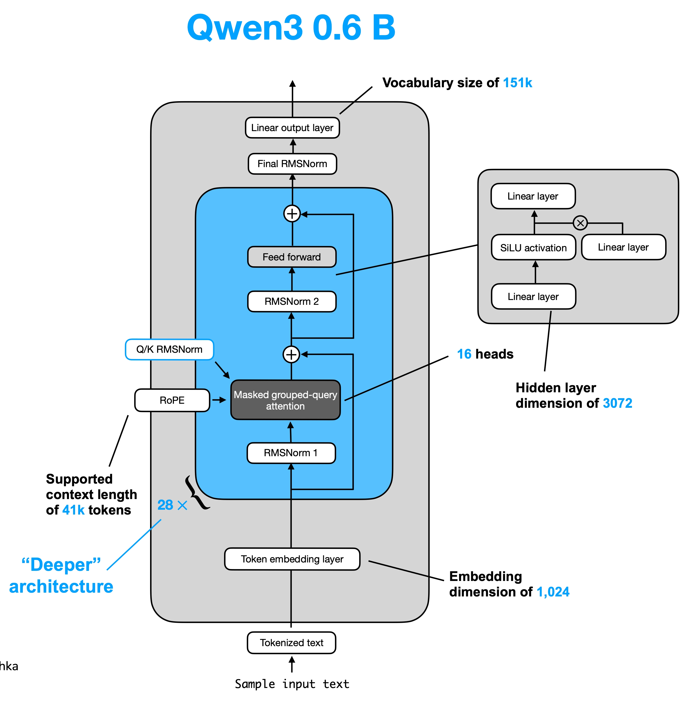

# Qwen 3 Series Model



## Qwen 3 0.6B

1. Base Code (No Optimizations)

```
==================================================
Qwen3Model(
  (tok_emb): Embedding(151936, 1024)
  (trf_blocks): ModuleList(
    (0-27): 28 x TransformerBlock(
      (att): GroupedQueryAttention(
        (W_query): Linear(in_features=1024, out_features=2048, bias=False)
        (W_key): Linear(in_features=1024, out_features=1024, bias=False)
        (W_value): Linear(in_features=1024, out_features=1024, bias=False)
        (out_proj): Linear(in_features=2048, out_features=1024, bias=False)
        (q_norm): RMSNorm()
        (k_norm): RMSNorm()
      )
      (ff): FeedForward(
        (fc1): Linear(in_features=1024, out_features=3072, bias=False)
        (fc2): Linear(in_features=1024, out_features=3072, bias=False)
        (fc3): Linear(in_features=3072, out_features=1024, bias=False)
      )
      (norm1): RMSNorm()
      (norm2): RMSNorm()
    )
  )
  (final_norm): RMSNorm()
  (out_head): Linear(in_features=1024, out_features=151936, bias=False)
)
==================================================
Total number of parameters: 751,632,384

Total number of unique parameters: 596,049,920
==================================================
float32 (PyTorch default): 5.64 GB
bfloat16: 2.82 GB
==================================================
```

# Updated Model Code

1. Flash Attention
2. Weight Sharing
3. Fused MLP
4. Optimize Mask Creation
5. RMSNorm with Fused RMSNorm

## Flash Attention

```python3
context = torch.nn.functional.scaled_dot_product_attention(
    queries, keys, values,
    attn_mask=mask,  # This can be None or a boolean mask
    dropout_p=0.0,   # or nonzero if training
    is_causal=False  # or True, depending on your attention type
)
```

## Weight Sharing

```python3
# implementing weight sharing
self.out_head.weight = self.tok_emb.weight
```

## Fused MLP
```python3
def forward(self, x):
    x = self.fc1(x)
    x = F.silu(x) * self.fc2(x)
    return self.fc3(x)
```

## Optimize Mask Creation

```python3
mask = torch.triu(torch.ones(num_tokens, num_tokens, device=x.device, dtype=torch.bool), diagonal=1)
```

## RMSNorm with Fused RMSNorm
```python3
self.norm1 = FusedRMSNorm(config["emb_dim"], eps=1e-6)
self.norm2 = FusedRMSNorm(config["emb_dim"], eps=1e-6)
```

# Model Output

```
==================================================
Qwen3Model(
  (tok_emb): Embedding(151936, 1024)
  (trf_blocks): ModuleList(
    (0-27): 28 x TransformerBlock(
      (att): GroupedQueryAttention(
        (W_query): Linear(in_features=1024, out_features=2048, bias=False)
        (W_key): Linear(in_features=1024, out_features=1024, bias=False)
        (W_value): Linear(in_features=1024, out_features=1024, bias=False)
        (out_proj): Linear(in_features=2048, out_features=1024, bias=False)
        (q_norm): RMSNorm()
        (k_norm): RMSNorm()
      )
      (ff): FeedForward(
        (fc1): Linear(in_features=1024, out_features=3072, bias=False)
        (fc2): Linear(in_features=1024, out_features=3072, bias=False)
        (fc3): Linear(in_features=3072, out_features=1024, bias=False)
      )
      (norm1): RMSNorm()
      (norm2): RMSNorm()
    )
  )
  (final_norm): RMSNorm()
  (out_head): Linear(in_features=1024, out_features=151936, bias=False)
)
==================================================
Total number of parameters: 596,049,920

Total number of unique parameters: 440,467,456
==================================================
float32 (PyTorch default): 4.48 GB
bfloat16: 2.24 GB
==================================================
```